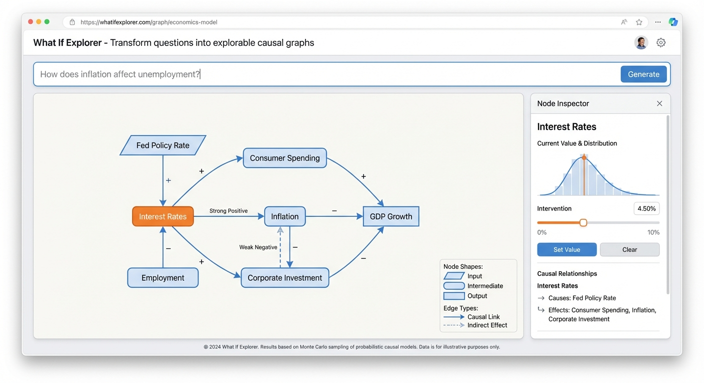

# What If Explorer



An interactive web tool that transforms natural language questions into explorable causal graphs. Describe a cause-and-effect relationship you want to understand, and the system generates a Structural Causal Model (SCM) you can manipulate through interventions.

## How It Works

1. **Query Processing**: User's natural language question is sent to Gemini with a structured prompt
2. **Model Generation**: Gemini returns a JSON Structural Causal Model with nodes, edges, and distributions
3. **Validation**: The model is validated for connectivity and correct node typing
4. **Rendering**: D3.js renders the DAG using dagre for layout
5. **Inference**: When interventions are made, Monte Carlo sampling propagates effects through the graph
6. **Visualization**: Node distributions update in real-time based on propagated samples

## Features

- **Natural Language Input**: Ask questions like "How does inflation affect unemployment?" or "What drives housing prices?"
- **AI-Generated Causal Models**: Uses Gemini to generate realistic causal graphs with appropriate probability distributions
- **Interactive Interventions**: Click nodes to apply the do-operator and see how changes propagate through the system
- **Monte Carlo Simulation**: Real-time propagation of effects using sampling-based inference
- **Visual Node Types**: Different shapes indicate node roles (exogenous inputs, endogenous variables, terminal outcomes, gatekeepers)

## Getting Started

### Prerequisites

- Node.js 18+
- A Google Gemini API key

### Installation

```bash
# Clone the repository
git clone https://github.com/yourusername/whatifexplorer.git
cd whatifexplorer

# Install dependencies
npm install

# Set up environment variables
cp .env.example .env
# Edit .env and add your GEMINI_API_KEY

# Start the development server
npm run dev
```

Open [http://localhost:3000](http://localhost:3000) in your browser.

### Environment Variables

| Variable | Description |
|----------|-------------|
| `GEMINI_API_KEY` | Your Google Gemini API key (get one at [Google AI Studio](https://makersuite.google.com/app/apikey)) |

## Usage

1. Enter a causal question in the input box (e.g., "What factors influence climate change?")
2. Click "Generate" to create a causal model
3. Click any node to select it and view details in the inspector panel
4. Use the slider to set an intervention value
5. Click "Set Value" to apply the intervention and see effects propagate

### Node Shapes

| Shape | Meaning |
|-------|---------|
| Rounded rectangle | Standard endogenous variable |
| Hard-corner rectangle | Terminal outcome (no children) |
| Parallelogram | Exogenous input (no parents) |
| Octagon | Gatekeeper node (filters/transforms) |

## Tech Stack

- **Framework**: Next.js 14 (App Router)
- **State Management**: Zustand
- **Visualization**: D3.js with dagre layout
- **LLM**: Google Gemini Flash
- **Styling**: Tailwind CSS
- **Language**: TypeScript

## Project Structure

```
src/
├── app/              # Next.js app router pages
├── components/       # React components
│   ├── CausalGraph.tsx    # Main graph visualization
│   ├── NodeInspector.tsx  # Node details panel
│   ├── QueryInput.tsx     # Query input form
│   └── ...
├── lib/              # Core logic
│   ├── inference.ts       # Monte Carlo propagation
│   ├── distributions.ts   # Probability distributions
│   └── llm.ts            # Gemini API integration
├── store/            # Zustand state management
└── types/            # TypeScript type definitions
```

## License

MIT
