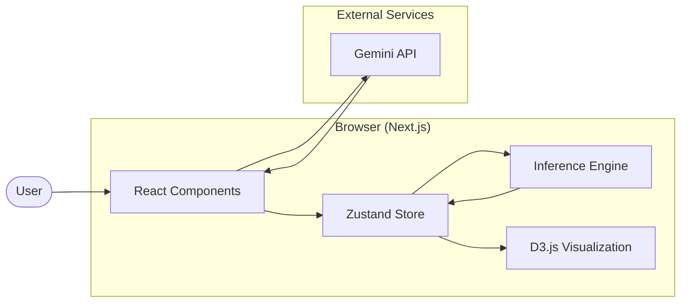
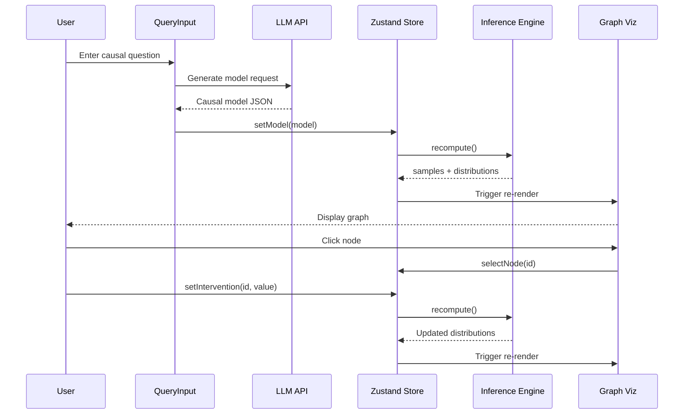
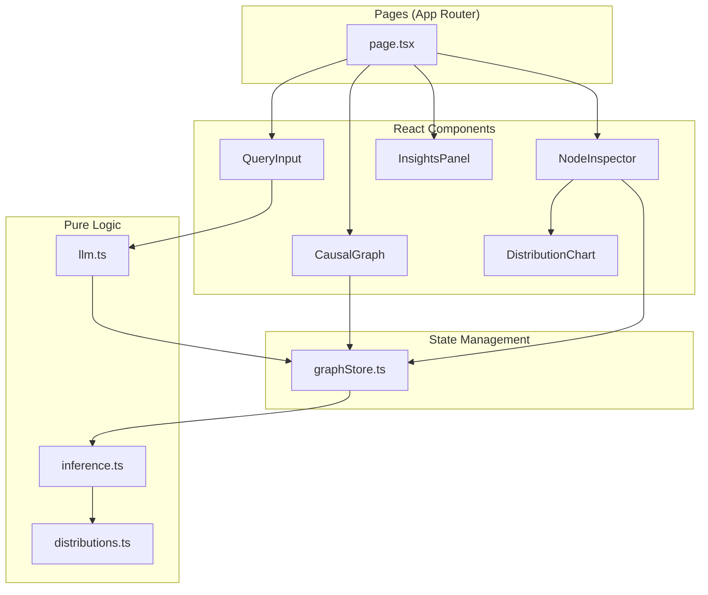
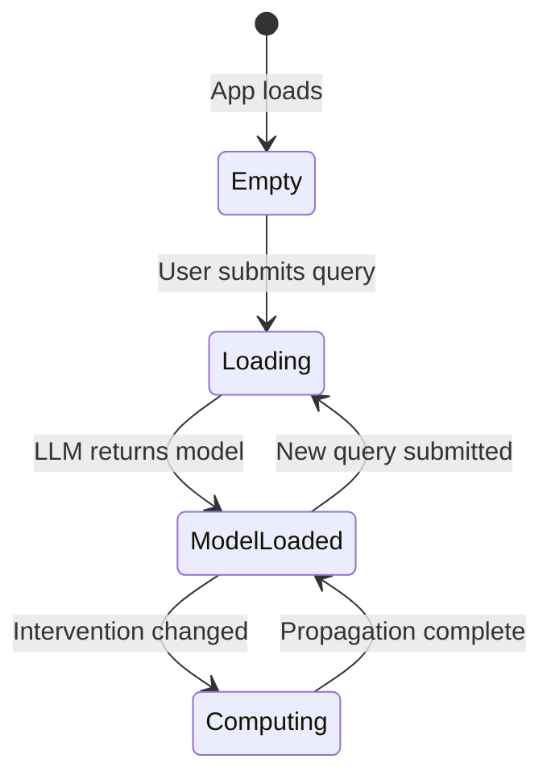
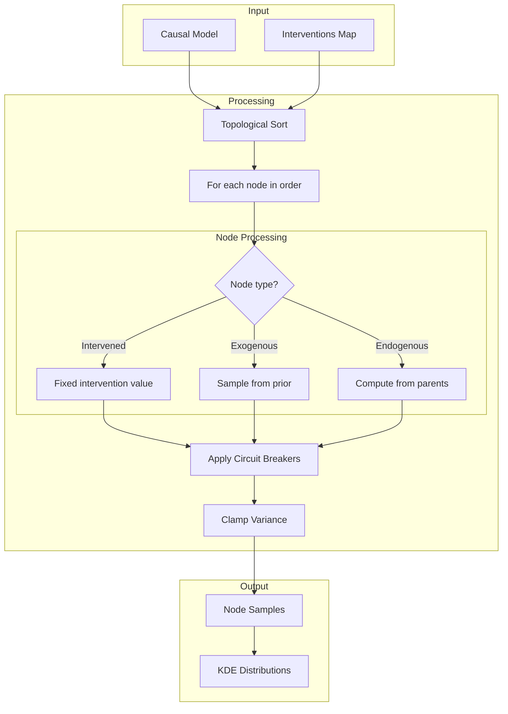
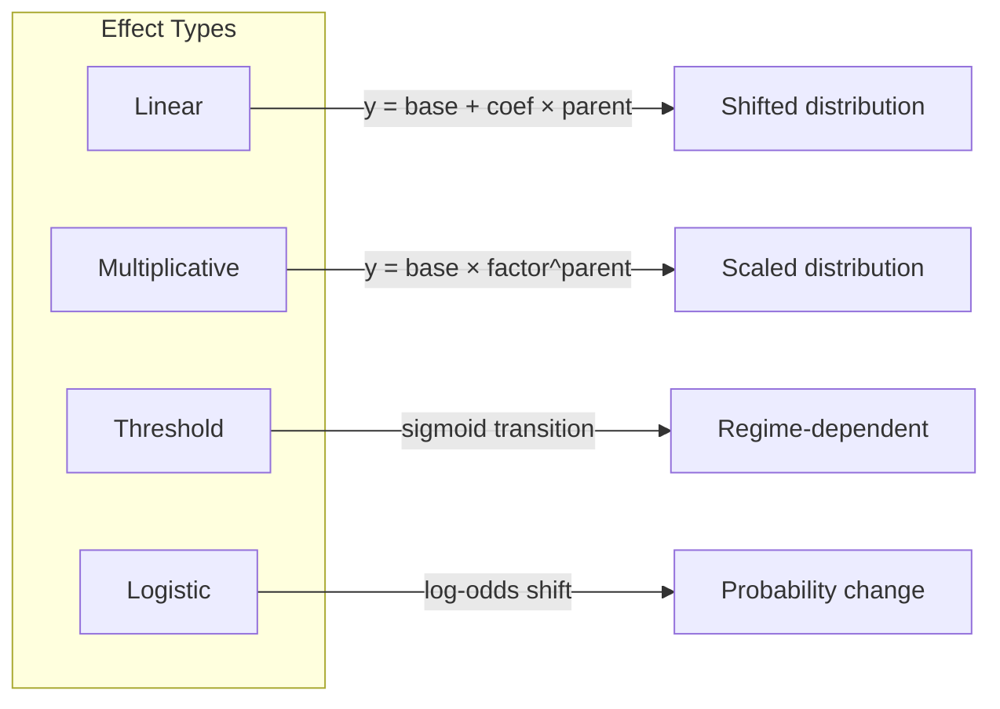
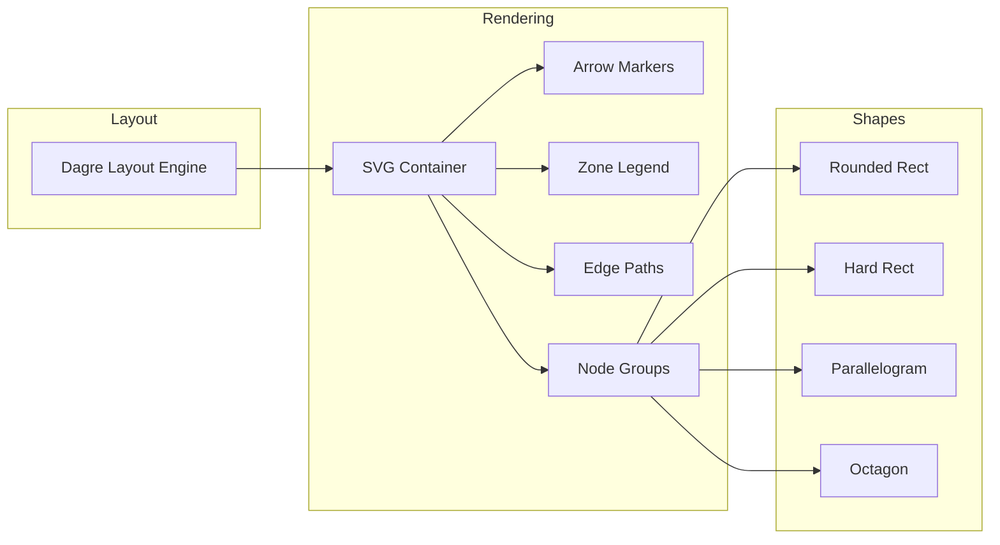
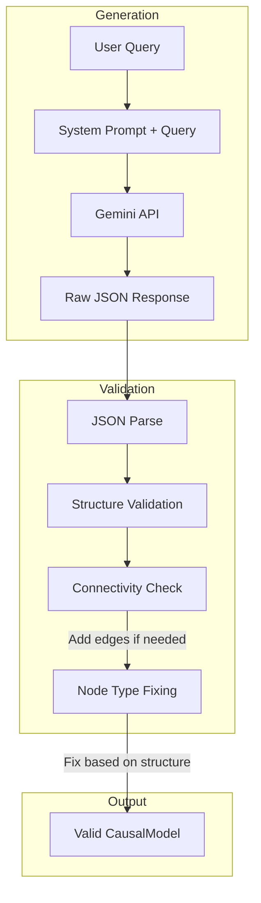
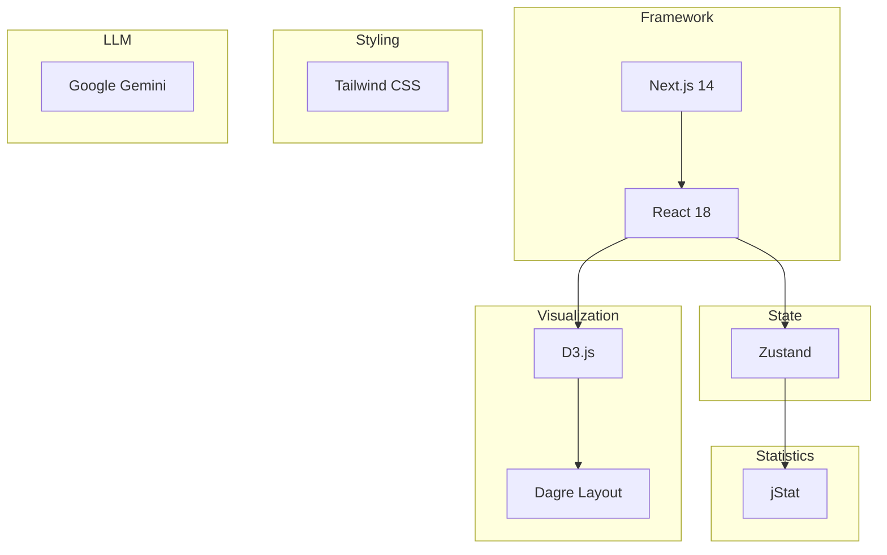

# What If Explorer: Technical Architecture

## System Overview

What If Explorer is a client-side web application that generates and visualizes causal models. The system transforms natural language queries into interactive directed acyclic graphs (DAGs) using an LLM, then enables users to perform causal interventions with real-time probabilistic propagation.


<!--

-->

## Data Flow

The application follows a unidirectional data flow pattern. User actions trigger state updates, which cascade through the inference engine and update the visualization.


<!--

-->

## Component Architecture

The frontend is organized into presentation components, a centralized store, and pure logic modules.


<!--

-->

## State Management

Zustand provides a simple, centralized store for all application state. The store holds the causal model, intervention state, and computed distributions.

<!--

-->

### Store Structure

The store is divided into three concerns:

1. **Model State**: The causal graph structure from the LLM
2. **Intervention State**: User-set node values (do-operator)
3. **Computed State**: Monte Carlo samples and KDE distributions

When interventions change, the store triggers recomputation, which updates all downstream distributions.

## Inference Engine

The inference engine implements Pearl's do-calculus through Monte Carlo sampling. This approach handles non-linear effects and produces realistic uncertainty propagation.


<!--

-->

### Propagation Algorithm

Nodes are processed in topological order (parents before children). For each node:

1. **Intervened nodes**: All samples set to the intervention value
2. **Exogenous nodes**: Samples drawn from prior distribution
3. **Endogenous nodes**: Base samples modified by parent effects

Effects are applied sample-by-sample, preserving correlations across the graph.

### Effect Functions

Four effect types transform how parent values influence children:

| Effect Type | Formula | Output |
|-------------|---------|--------|
| Linear | y = base + coef × parent | Shifted distribution |
| Multiplicative | y = base × factor^parent | Scaled distribution |
| Threshold | sigmoid transition | Regime-dependent |
| Logistic | log-odds shift | Probability change |

<!--

-->

### Circuit Breakers

Safety mechanisms prevent distributions from exploding through cascading effects:

| Breaker | Purpose | Implementation |
|---------|---------|----------------|
| Boundary Awareness | Respect physical limits | Clamp to min/max values |
| Variance Clamping | Prevent flat distributions | Compress if std > 3× mean |
| Multiplier Cap | Prevent exponential growth | Limit to 0.1x - 10x range |

## Graph Visualization

D3.js renders the causal graph with dagre providing the layout algorithm. The visualization pipeline:

**Layout** → Dagre Layout Engine → **Rendering** (SVG Container, Arrow Markers, Zone Legend, Edge Paths, Node Groups) → **Shapes** (Rounded Rect, Hard Rect, Parallelogram, Octagon)

<!--

-->

### Node Shape Mapping

Shapes communicate node semantics at a glance:

| Shape | SVG Element | Node Type | Visual Meaning |
|-------|-------------|-----------|----------------|
| Rounded rectangle | `rect` with rx | Standard | Interior variable |
| Hard rectangle | `rect` no rx | Terminal | Final outcome |
| Parallelogram | `polygon` | Exogenous | External input |
| Wide octagon | `polygon` | Gatekeeper | Filter/gate |

## LLM Integration

The LLM generates causal models from natural language through structured prompting. A validation layer ensures model correctness.

**Generation**: User Query → System Prompt + Query → Gemini API → Raw JSON Response

**Validation**: JSON Parse → Structure Validation → Connectivity Check → Node Type Fixing → Valid CausalModel

<!--

-->

### Validation Steps

1. **Structure Validation**: Verify nodes, edges, and zones arrays exist
2. **Connectivity Check**: Find disconnected components, add edges to connect them
3. **Node Type Fixing**:
   - Nodes with no incoming edges → exogenous
   - Nodes with no outgoing edges → terminal
   - Nodes marked terminal but with children → endogenous

## Technology Stack

| Category | Technology |
|----------|------------|
| Framework | Next.js 14, React 18 |
| State | Zustand |
| Visualization | D3.js, Dagre Layout |
| Statistics | jStat |
| Styling | Tailwind CSS |
| LLM | Google Gemini |

<!--

-->

## File Structure

```
src/
├── app/
│   └── page.tsx              # Main page layout
├── components/
│   ├── CausalGraph.tsx       # D3 graph visualization
│   ├── NodeInspector.tsx     # Node details panel
│   ├── QueryInput.tsx        # Query form
│   ├── DistributionChart.tsx # KDE visualization
│   └── InsightsPanel.tsx     # Key insights display
├── lib/
│   ├── inference.ts          # Monte Carlo propagation
│   ├── distributions.ts      # Probability distributions
│   └── llm.ts               # Gemini integration + validation
├── store/
│   └── graphStore.ts         # Zustand state management
└── types/
    └── causal.ts             # TypeScript type definitions
```

## Performance Considerations

| Operation | Target | Approach |
|-----------|--------|----------|
| Model generation | < 20s | Streaming response, loading indicator |
| Propagation | < 100ms | 100 samples, optimized loops |
| KDE computation | < 50ms | 50 density points, Silverman bandwidth |
| Graph rendering | < 16ms | D3 efficient updates, dagre caching |

The 100-sample Monte Carlo provides a good balance between accuracy and speed. Increasing to 1000 samples would improve precision but risks UI lag during slider interactions.
