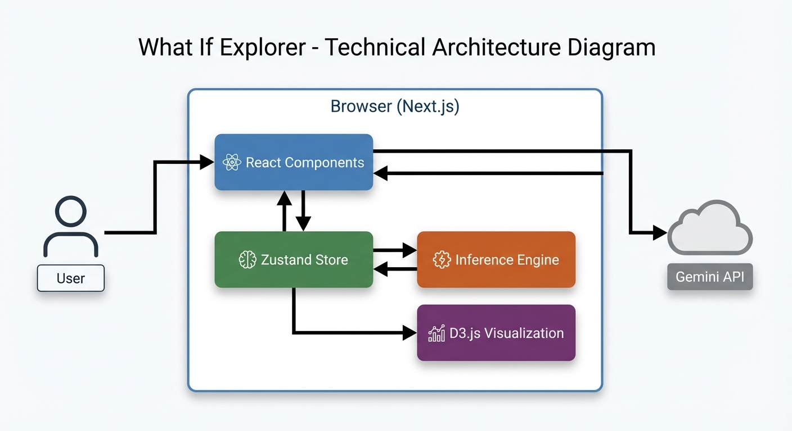
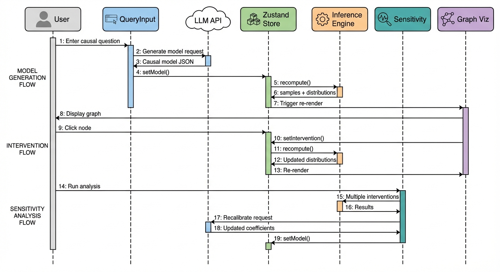
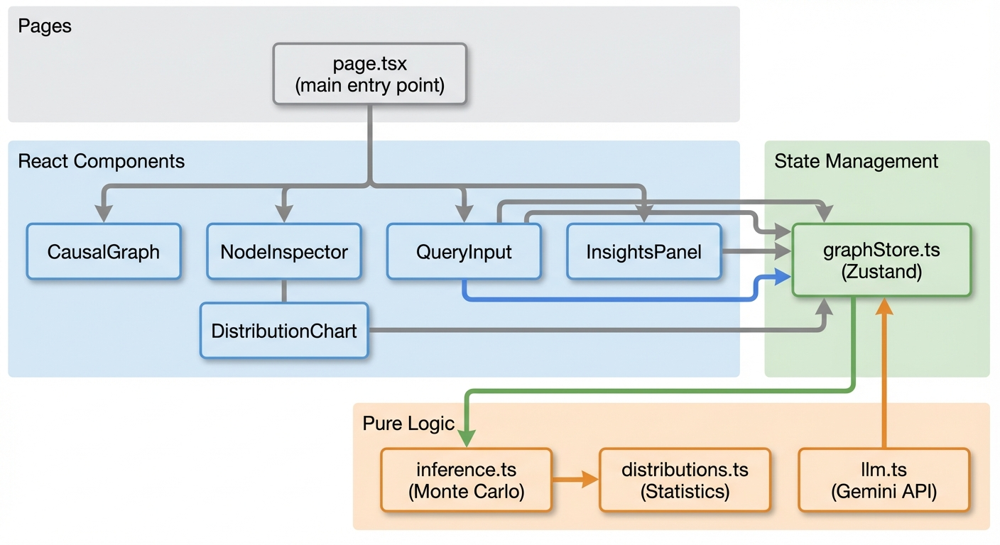
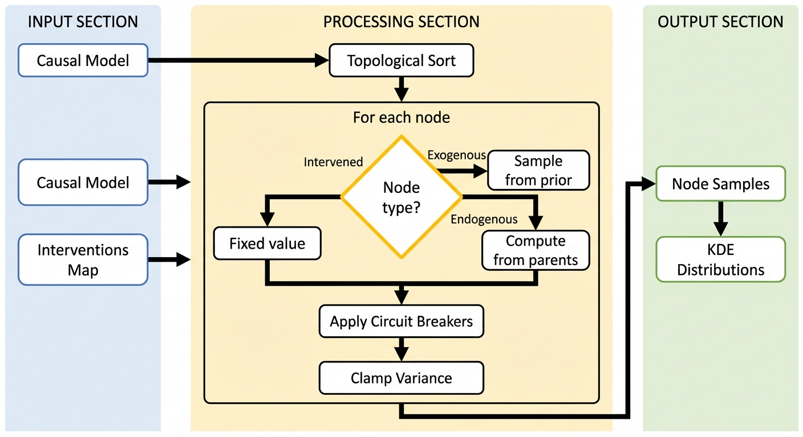

# What If Explorer: Technical Architecture

## System Overview

What If Explorer is a client-side web application that generates and visualizes causal models. The system transforms natural language queries into interactive directed acyclic graphs (DAGs) using an LLM, then enables users to perform causal interventions with real-time probabilistic propagation.



The architecture is entirely client-side except for LLM calls. This keeps the system simple (no backend to deploy) and enables real-time interactivity—when a user drags an intervention slider, the inference engine runs immediately in the browser without network latency.

Zustand serves as the single source of truth. Components never talk to each other directly; they read from and write to the store. This makes the data flow predictable: user action → store update → automatic re-renders. The store also coordinates the inference engine—whenever the model or interventions change, it triggers `recompute()` which propagates effects through the causal graph.

The inference engine is pure computation with no UI dependencies. Given a causal model and a set of interventions, it returns probability distributions. This separation means we can test the inference logic independently and potentially move it to a Web Worker for heavier computations.

D3.js handles rendering because React's virtual DOM isn't suited for complex SVG manipulation with hundreds of elements. D3 gives us direct control over the graph layout (via dagre) and smooth transitions when distributions update. The tradeoff is more imperative code, but the performance is worth it.

Gemini generates the initial model from natural language. This is the only server dependency—everything after model generation runs locally. The LLM returns a structured JSON schema that defines nodes, edges, probability distributions, and causal effect functions.

## Data Flow



Data flows in one direction: user action → state change → recomputation → render. This unidirectional pattern eliminates a whole class of bugs where UI gets out of sync with underlying data—there's exactly one path for updates to take.

### Model Generation

When the user submits a query, the `QueryInput` component calls the Gemini API directly (via a Next.js API route to keep the API key server-side). The LLM returns a complete causal model as JSON—nodes with their probability distributions, edges with their effect functions, and zones for visual grouping.

The component doesn't try to render anything itself. It just calls `setModel()` on the store, which triggers a cascade: the store saves the model, immediately calls `recompute()` to generate initial distributions via Monte Carlo sampling, and React's subscription to the store causes all dependent components to re-render with the new data.

This means the QueryInput component has no idea how the graph is rendered or how inference works. It just hands off data and the system takes care of the rest.

### Intervention Flow

Interventions demonstrate the power of centralized state. When a user clicks a node, the graph visualization calls `selectNode(id)`. When they adjust the slider and click "Set Value", the NodeInspector calls `setIntervention(nodeId, value)`.

The store doesn't just save the intervention—it immediately triggers `recompute()`. The inference engine sees the intervention in its input map and fixes that node's samples to the intervention value instead of sampling from its distribution. Effects propagate to all descendants, new distributions come back, and every component subscribed to `nodeDistributions` re-renders.

The critical insight: **the slider interaction feels instant** because all computation happens synchronously in the browser. There's no round-trip to a server. 100 Monte Carlo samples across a 20-node graph completes in under 50ms.

## Component Architecture



The codebase separates concerns into three layers: **React components** handle user interaction and display, the **Zustand store** manages all application state, and **pure logic modules** contain the computational core with no UI dependencies.

### React Components

**CausalGraph** is the most complex component—it manages a D3.js visualization inside a React lifecycle. On mount, it dynamically imports dagre (the layout library), then uses D3 to render SVG elements for nodes, edges, and the zone legend. It subscribes to the store for model data, interventions, and distributions, re-rendering the entire graph when these change. Click handlers on nodes call back to the store's `selectNode()` and the graph highlights the selection.

**NodeInspector** appears when a node is selected. It shows the node's description, its probability distribution as a density curve (via DistributionChart), and an intervention slider. The slider range is derived from the node's distribution bounds. When the user clicks "Set Value", it calls `setIntervention()` on the store. The panel also lists parent and child nodes so users understand the node's causal context.

**QueryInput** is intentionally simple—a text field and a button. On submit, it calls the `/api/generate` endpoint with the query, shows a loading spinner, and on success calls `setModel()`. It doesn't know anything about causal inference or graph rendering.

**InsightsPanel** displays LLM-generated insights about the causal structure. These are generated alongside the model and highlight key relationships, potential bottlenecks, and non-obvious causal pathways.

### Pure Logic Modules

The logic layer has no React imports. This makes it testable, portable, and potentially movable to a Web Worker.

**inference.ts** implements the Monte Carlo propagation algorithm. Given a model and interventions map, it topologically sorts nodes, samples from distributions, applies effect functions, and returns both raw samples and KDE distributions for visualization. The entire computation is synchronous and deterministic given the same random seed.

**distributions.ts** handles probability math—sampling from various distribution types (normal, lognormal, beta, bounded uniform) and computing kernel density estimates for visualization. It wraps jStat for the heavy statistical lifting.

**llm.ts** constructs the prompt for Gemini, parses the JSON response, and validates the resulting model. Validation includes checking for disconnected subgraphs (which it fixes by adding edges) and correcting node types based on graph structure (nodes with no parents become exogenous, nodes with no children become terminal).

## State Management

Zustand was chosen over Redux or React Context for its simplicity. The entire store is defined in a single file with no boilerplate—actions are just functions that call `set()`. Components subscribe to specific slices of state using selector functions, so they only re-render when their slice changes.

The store manages four categories of state:

**Model state** holds the causal graph returned by the LLM: nodes (with their distributions and metadata), edges (with their effect functions), and zones (for color-coded grouping). This is set once when the model loads and doesn't change until a new query is submitted.

**Intervention state** is a Map from node ID to intervention value. When a user sets an intervention, the node ID and value are added to this map. The inference engine checks this map for each node—if present, it uses the fixed value instead of sampling. Clearing an intervention removes the entry from the map.

**Computed state** contains the Monte Carlo samples and KDE distributions for each node. This is derived data—it's recomputed whenever the model or interventions change. Components read from this to display distribution charts and node means. We store both raw samples (for statistical analysis) and pre-computed KDE curves (for rendering).

**UI state** tracks which node is selected, which is hovered, and whether panels are visible. This is purely presentational and doesn't affect inference.

The store exposes granular selector hooks (`useModel()`, `useInterventions()`, `useNodeDistribution(id)`) so components can subscribe to exactly what they need. A component showing a single node's distribution doesn't re-render when a different node's distribution changes.

## Inference Engine



The inference engine implements Pearl's do-calculus—the mathematical framework for causal intervention—through Monte Carlo sampling. Why Monte Carlo instead of analytical solutions? Because real causal relationships are often non-linear (threshold effects, multiplicative interactions), and propagating uncertainty through non-linear functions doesn't have closed-form solutions. Sampling handles arbitrary complexity.

### How Propagation Works

The algorithm processes nodes in topological order (parents before children) using Kahn's algorithm. This guarantees that when we compute a node's samples, all its parent samples are already available.

For each node, we generate 100 samples (a tunable constant). The source of these samples depends on the node's status:

**Intervened nodes** get all 100 samples set to the intervention value. This is the "do" operator—we're not observing the node, we're forcing it to a specific value. The node's natural distribution is irrelevant; we've surgically set it.

**Exogenous nodes** (no parents) sample directly from their prior distribution. These are the root causes in the system—external inputs that aren't explained by other variables in the model.

**Endogenous nodes** start with samples from their prior distribution, then each sample is modified by parent effects. Critically, we apply effects sample-by-sample: sample[i] of the child is computed from sample[i] of each parent. This preserves correlations—if a parent had an unusually high value in sample 17, the child will reflect that in sample 17.

### Effect Functions

Each edge in the graph has an effect function that transforms how parent values influence children:

**Linear effects** (`y = base + coefficient × parent`) shift the distribution. A coefficient of 0.5 means a 1-unit increase in the parent shifts the child's mean by 0.5 units. This handles direct proportional relationships like "higher interest rates reduce borrowing."

**Multiplicative effects** (`y = base × factor^parent`) scale the distribution. This captures compounding relationships where changes multiply rather than add—confidence doesn't add to spending, it amplifies it.

**Threshold effects** use a sigmoid function to model regime changes. Below the cutoff, one effect dominates; above it, another takes over. The transition is smooth (controlled by a "smoothness" parameter) rather than a hard switch. This models tipping points—a economy might absorb small shocks but collapse under large ones.

**Logistic effects** shift log-odds, useful for binary outcomes where we're modeling probabilities. A parent variable might increase or decrease the probability of a binary event occurring.

### Preventing Distribution Explosions

Without safeguards, cascading effects can produce absurd distributions—infinite variance, values outside physical bounds, or numerical overflow. Circuit breakers prevent this:

**Boundary clamping** enforces physical limits. An unemployment rate can't go below 0% or above 100%. If samples land outside these bounds, they're clamped. This respects domain constraints the LLM specified in the node definition.

**Variance clamping** compresses distributions that become too spread out. If the standard deviation exceeds 3× the mean (a tunable threshold), samples are compressed toward the mean. This prevents the "uncertainty explosion" where downstream nodes become meaninglessly uncertain.

**Multiplier caps** limit multiplicative effects to a 0.1×–10× range. Without this, exponential growth can produce astronomically large or infinitesimally small values within a few propagation steps.

## Graph Visualization

D3.js renders the causal graph because React's reconciliation doesn't play well with complex SVG manipulation. When you have 20+ nodes, dozens of edges, and need pixel-perfect control over arrow positioning, D3's imperative approach is cleaner than fighting React's declarative model.

### Layout with Dagre

Dagre is a JavaScript library that computes optimal positions for directed acyclic graphs. You give it nodes with estimated dimensions and edges, and it returns x/y coordinates that minimize edge crossings and maintain hierarchical flow (parents above children).

The layout runs once when the model loads. We configure it for top-to-bottom flow (`rankdir: 'TB'`), which makes causal direction intuitive—causes at the top, effects below. Horizontal and vertical spacing are tuned to prevent overlap while keeping the graph compact enough to fit on screen.

After dagre computes positions, we scale and center the graph within the SVG viewport. The scaling factor is capped at 1.2× to prevent tiny graphs from blowing up to fill the screen.

### Rendering Pipeline

The SVG is cleared and rebuilt on each render (when model or distributions change). This sounds expensive but is actually faster than diffing—D3's selection model isn't designed for incremental updates the way React's virtual DOM is.

Rendering proceeds in layers:
1. Arrow marker definitions in `<defs>` (reused by all edges)
2. Zone legend at the top—horizontal color-coded chips showing category labels
3. Edges as `<path>` elements with arrowhead markers
4. Nodes as `<g>` groups containing shape, label, and mean indicator

### Shape Semantics

Node shapes encode type at a glance, following conventions from causal diagram notation:

**Rounded rectangles** (standard endogenous) are the default—variables that have parents and children, sitting in the middle of causal chains.

**Hard-corner rectangles** mark terminal outcomes—the endpoints we ultimately care about. These have no outgoing edges; they're the "so what" of the model.

**Parallelograms** indicate exogenous inputs—external factors that enter the system but aren't explained by it. These have no incoming edges; they're given, not derived.

**Octagons** represent gatekeeper nodes that filter or transform information flow (though these are less common in practice).

### Visual Feedback

Nodes change appearance based on state:
- Selected nodes get a thicker border and subtle drop shadow
- Intervened nodes turn yellow with an orange border and glow effect, making it obvious which variables have been manually set
- Each node displays its current mean (`μ=X.X`) and units, so you can see values without opening the inspector
- Zone colors group related variables (Economic factors in blue, Social in green, etc.)

## LLM Integration

The LLM's job is to translate "How does X affect Y?" into a formal causal model with nodes, edges, probability distributions, and effect functions. This is a structured generation task—we need valid JSON conforming to a specific schema, not freeform text.

### Prompt Engineering

The system prompt is extensive (~2000 tokens) and does several things:

First, it explains what a Structural Causal Model is and the components we need: nodes (variables with distributions), edges (causal relationships with effect functions), and zones (thematic groupings for visual organization).

Second, it provides the exact JSON schema with TypeScript-style type definitions. The LLM sees what fields are required, what values are valid for enums (distribution types, effect types, node shapes), and examples of well-formed output.

Third, it gives domain guidance: use realistic probability distributions (unemployment is bounded 0-100%, prices are lognormal), choose appropriate effect types (interest rates have linear effects on borrowing, confidence has multiplicative effects on spending), and ensure the graph tells a coherent causal story.

The user's query is appended to this system prompt, and we request JSON output with Gemini's `responseMimeType: "application/json"` setting.

### Validation and Repair

LLMs don't always produce valid output, so we validate and repair the response:

**Structure validation** checks that the required arrays exist and have the right shape. If nodes, edges, or zones are missing, we throw an error—there's no reasonable default.

**Connectivity checking** finds disconnected subgraphs. A model where "Interest Rates" and "Inflation" have no path between them isn't useful. When we find disconnected components, we add synthetic edges to connect them, making assumptions about likely causal direction based on node types.

**Type fixing** corrects inconsistencies between declared node types and graph structure. If the LLM says a node is "terminal" but it has outgoing edges, we change it to "endogenous". If a node has no incoming edges, it must be "exogenous" regardless of what the LLM said. These rules are mechanical—graph structure determines type, not labels.

### Why Gemini?

We use Google's Gemini Flash model because it's fast (responses in 2-5 seconds), cheap, and good at structured JSON generation. The model choice is abstracted behind the `llm.ts` module—swapping to GPT-4 or Claude would require changing the API call format but not the prompt or validation logic.

## Technology Stack

**Next.js 14** with the App Router provides the framework. We only use it lightly—there's a single page and one API route. The API route exists solely to proxy Gemini calls so the API key stays server-side.

**Zustand** handles state because it's 10x simpler than Redux with no boilerplate. The entire store is one file, and adding a new piece of state is one line of code.

**D3.js + Dagre** handle visualization. D3 does SVG rendering, Dagre does DAG layout. We considered vis.js and Cytoscape but needed more control over node shapes and styling.

**jStat** provides statistical functions—sampling from various distributions and computing KDEs. It's not the fastest library, but it's well-tested and covers all the distribution types we need.

**Tailwind CSS** for styling because utility classes are faster to iterate with than writing CSS files, and the design is simple enough that we don't need a component library.

## File Structure

```
src/
├── app/
│   ├── page.tsx              # Single page app - composes all components
│   └── api/generate/route.ts # Proxies Gemini API calls (keeps key server-side)
├── components/
│   ├── CausalGraph.tsx       # D3 visualization - most complex component
│   ├── NodeInspector.tsx     # Side panel for selected node details
│   ├── QueryInput.tsx        # Text input + generate button
│   ├── DistributionChart.tsx # Small KDE curve renderer
│   └── InsightsPanel.tsx     # LLM-generated insights display
├── lib/
│   ├── inference.ts          # Core algorithm - topological sort + Monte Carlo
│   ├── distributions.ts      # jStat wrappers + KDE computation
│   ├── llm.ts                # Prompt construction + response validation
│   └── sampleModels.ts       # Hardcoded models for testing without LLM
├── store/
│   └── graphStore.ts         # All application state in one Zustand store
└── types/
    └── causal.ts             # TypeScript interfaces for the causal model schema
```

## Performance

The performance budget targets interactive feel—interventions should update instantly, not after a perceivable delay.

**Model generation** takes 2-10 seconds depending on query complexity. This is acceptable because it's a one-time cost when starting exploration. A loading spinner sets expectations.

**Propagation** must complete in under 100ms to feel instant. With 100 samples and ~20 nodes, we typically see 20-50ms. The algorithm is O(nodes × samples × average_parents), so larger graphs would need sample count reduction or Web Worker offloading.

**KDE computation** adds another 10-30ms. We compute 50 density points per distribution using Silverman's rule for bandwidth selection. This could be optimized by caching KDEs for nodes that haven't changed, but it hasn't been necessary.

**Rendering** targets 16ms (60fps). D3's full re-render approach sounds expensive but empirically finishes in 5-10ms for typical graphs. The SVG is simple enough that browser painting isn't the bottleneck.

The 100-sample count is a pragmatic choice. More samples would give smoother distributions, but the visual difference above ~100 is negligible while computation time scales linearly.
