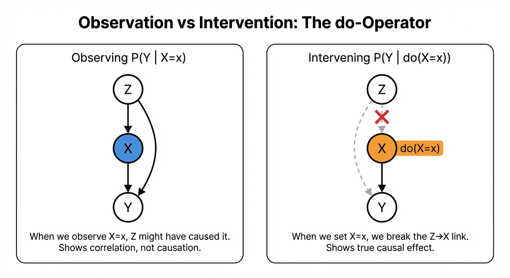
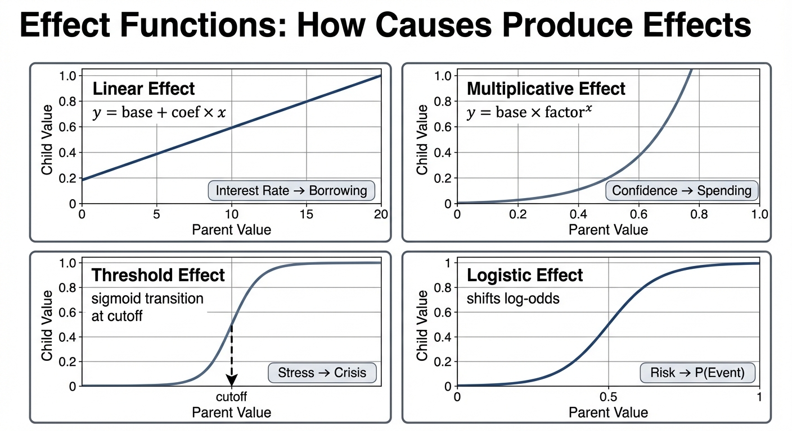
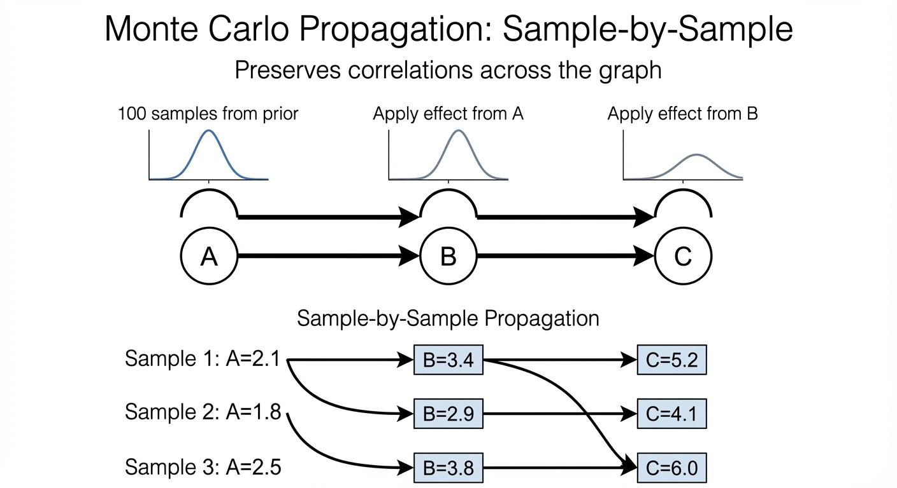

# Causal Modeling in What If Explorer

This document explains how What If Explorer represents and reasons about causal relationships. If you're interested in the application architecture, see [Architecture.md](./Architecture.md).

## What is a Structural Causal Model?

A Structural Causal Model (SCM) is a mathematical framework for representing cause-and-effect relationships, developed by Judea Pearl. It consists of:

- **Variables** representing measurable quantities (unemployment rate, interest rates, consumer confidence)
- **Directed edges** representing causal relationships (interest rates → borrowing → investment)
- **Probability distributions** capturing uncertainty in each variable
- **Functional relationships** specifying how causes produce effects

The key distinction from correlation-based models: an SCM lets you answer *interventional* questions. "What happens to Y if I *force* X to a specific value?" is different from "What is Y when I *observe* X at that value?" The first is causal; the second is merely correlational.

## The do-Operator

Pearl's do-operator, written do(X = x), represents a surgical intervention—setting variable X to value x regardless of its natural causes. This is different from conditioning on X = x, which assumes we're observing X rather than manipulating it.



The diagram above illustrates the key distinction. On the left, when we *observe* X = x, the confounder Z might have caused both X and Y—so the correlation between X and Y includes both the causal effect and the confounding path through Z. On the right, when we *intervene* with do(X = x), we surgically cut the arrow from Z to X. Now X is set by us, not by Z, so the only path to Y is the direct causal effect.

When you move the intervention slider in What If Explorer and click "Set Value", you're applying do(). The system fixes that variable's value and propagates effects to all downstream variables, ignoring whatever would have naturally caused that variable.

Concretely: if you do(Interest Rate = 7%), the model treats 7% as given. It doesn't matter what the Fed's policy rule would have produced—you've overridden it. All downstream effects (on borrowing, investment, employment) flow from this forced value.

## Model Structure

### Nodes

Each node in the graph represents a variable with:

| Field | Purpose |
|-------|---------|
| `id` | Unique identifier for edges and lookups |
| `label` | Human-readable name displayed in the graph |
| `description` | Longer explanation shown in the inspector |
| `type` | One of: exogenous, endogenous, terminal, gatekeeper |
| `distribution` | Prior probability distribution |
| `units` | Display units (%, $, etc.) |
| `zone` | Thematic grouping for visual organization |

Node types have structural meaning:

**Exogenous** nodes have no incoming edges—they're external inputs to the system. The Fed's policy rate is exogenous to a model of the economy; it's set by decision-makers outside the model's scope.

**Endogenous** nodes have both incoming and outgoing edges—they're determined by other variables and in turn affect others. GDP is endogenous: influenced by investment, consumption, and government spending, while affecting employment and tax revenue.

**Terminal** nodes have incoming edges but no outgoing edges—they're the outcomes we ultimately care about. Poverty rate might be terminal: we model what causes it, but don't model what it causes.

**Gatekeeper** nodes filter or transform information flow, often with threshold effects. A "financial crisis" node might only activate when stress exceeds a threshold, then dramatically affect downstream variables.

### Edges

Each edge represents a causal relationship with:

| Field | Purpose |
|-------|---------|
| `source` | ID of the cause node |
| `target` | ID of the effect node |
| `effect` | Function specifying how cause influences effect |
| `weight` | Visual weight (light, medium, heavy) |
| `style` | Line style (solid, dashed) |

The `effect` field contains the functional form—see Effect Functions below.

### Zones

Zones group related variables for visual organization:

| Field | Purpose |
|-------|---------|
| `id` | Unique identifier |
| `label` | Display name (e.g., "Economic Factors") |
| `color` | Background color for nodes in this zone |

Zones don't affect inference—they're purely visual. But they help users quickly identify clusters of related variables.

## Probability Distributions

Each node has a prior distribution representing uncertainty before any interventions. The LLM chooses appropriate distributions based on the variable's nature:

### Continuous (Normal)

For variables that can be positive or negative with symmetric uncertainty:
- GDP growth rate (mean: 2%, std: 1%)
- Temperature anomaly (mean: 0°C, std: 0.5°C)
- Sentiment scores (mean: 0, std: 1)

Parameters: `[mean, standardDeviation]`

### Lognormal

For positive-only variables with right skew:
- Prices (can't go negative, long tail of expensive items)
- Incomes (most people earn moderate amounts, few earn extremely high)
- Company sizes (many small firms, few giants)

Parameters: `[logMean, logStd]` (parameters of the underlying normal)

### Bounded

For variables constrained to a range:
- Unemployment rate (0-100%)
- Capacity utilization (0-100%)
- Probability estimates (0-1)

Parameters: `min`, `max`, `mean`

The implementation samples uniformly then applies a transformation to concentrate probability around the mean while respecting bounds.

### Beta

For proportions with flexible shapes:
- Market share (0-1, often concentrated near current value)
- Probability of rare events (0-1, concentrated near 0)
- Compliance rates (0-1, often concentrated near 1)

Parameters: `[alpha, beta]` shape parameters

## Effect Functions

Edges carry effect functions that transform how parent values influence children. Each effect type serves different causal relationships:



### Linear Effects

```
child = base + coefficient × parent
```

The workhorse of causal modeling. A coefficient of -0.5 means "a 1-unit increase in the parent decreases the child by 0.5 units."

Use for: direct proportional relationships
- Interest rates → borrowing (negative coefficient)
- Education spending → test scores (positive coefficient)
- Advertising → sales (positive, possibly with saturation)

Parameters:
- `coefficient`: strength and direction of effect
- `intercept`: baseline shift (usually 0)
- `saturation`: optional cap on effect magnitude using tanh

### Multiplicative Effects

```
doublings = log₂(parent / baseline)
multiplier = factor^doublings
child = base × multiplier
```

For relationships where the effect scales rather than shifts—the `factor` represents how much the child scales when the parent doubles from its baseline.

Use for: amplification, compounding, confidence effects
- Consumer confidence → spending (confidence amplifies spending)
- Risk perception → investment (fear multiplies caution)
- Network effects → adoption (each user multiplies value)
- Compound growth effects (interest, viral spread)

Parameters:
- `factor`: how much child scales when parent doubles (e.g., 2.0 means child doubles when parent doubles)
- `baseline`: reference parent value (typically the prior mean) where multiplier = 1

The multiplier is capped to 0.5×–2× with damping to prevent numerical explosion while preserving relative ordering of samples.

### Threshold Effects

```
multiplier = 1 + coefficient × (parent - cutoff) / |cutoff|
where coefficient = below × (1 - σ) + above × σ
and σ = sigmoid(smoothness × (parent - cutoff))
```

For regime changes—relationships that behave differently above and below a threshold. The `below` and `above` parameters are sensitivity coefficients that determine how strongly the child responds to parent deviations from the cutoff in each regime.

Use for: tipping points, phase transitions, policy thresholds
- Debt-to-GDP → risk premium (markets react more sharply above sustainability thresholds)
- Server load → response time (graceful below capacity, exponential degradation above)
- Temperature → ice melt (phase transition at 0°C)

Parameters:
- `cutoff`: threshold value where regime changes
- `below`: sensitivity coefficient when parent < cutoff
- `above`: sensitivity coefficient when parent > cutoff
- `smoothness`: how sharp the transition is (higher = sharper)

**Choosing Coefficients by Severity:**

| Regime | Range | Use For |
|--------|-------|---------|
| Subtle | 0.3-0.8 | Minor sensitivity differences, soft preferences |
| Moderate | 0.8-2.0 | Noticeable regime changes, risk premiums, congestion |
| Sharp | 2.0-5.0 | Capacity limits, policy triggers, stress thresholds |
| Near-binary | 5.0-10.0 | System failures, safety limits, breaking points |
| Catastrophic | 10.0+ | Structural collapse, cascading failures, point-of-no-return |

Example: Debt-to-GDP at 120% (moderate regime change): `below=0.5, above=1.5`
Example: Bridge load at 100% capacity (catastrophic): `below=0.1, above=12.0`

### Logistic Effects

```
logit(child) = logit(base) + coefficient × (parent - threshold)
```

For effects on probabilities. Shifts log-odds, which keeps the output bounded between 0 and 1.

Use for: binary outcomes, probability of events
- Economic stress → probability of recession
- Risk factors → probability of disease
- Features → probability of conversion

Parameters:
- `coefficient`: effect on log-odds
- `threshold`: parent value that produces no shift

## Monte Carlo Inference

What If Explorer uses Monte Carlo sampling to propagate interventions through the graph. This approach handles arbitrary non-linear relationships and produces realistic uncertainty propagation.



The diagram shows how samples flow through a causal chain. Each node maintains 100 samples. When we compute node B, we don't just use A's mean—we transform each of A's 100 samples through the effect function to produce B's 100 samples. This preserves the correlation structure: if sample 17 had an unusually high value for A, it will have a correspondingly affected value for B and C.

### Why Monte Carlo?

Analytical propagation (computing exact distributions) only works for linear-Gaussian models. Real causal relationships involve thresholds, multiplicative effects, and bounded distributions. Sampling handles all of these without special cases.

The tradeoff is computation time and sampling noise. With 100 samples, we get smooth-enough distributions for visualization while keeping propagation under 50ms.

### The Algorithm

1. **Topological sort**: Order nodes so parents come before children (using Kahn's algorithm)

2. **For each node in order**:
   - If **intervened**: fill all 100 samples with the intervention value
   - If **exogenous**: draw 100 samples from the prior distribution
   - If **endogenous**: draw 100 base samples from prior, then modify each based on parent samples

3. **Apply effects sample-by-sample**: Sample i of the child is computed from sample i of each parent. This preserves correlations—an unusually high parent in sample 17 produces correspondingly affected children in sample 17.

4. **Apply circuit breakers**: Clamp values to bounds, compress excessive variance

5. **Compute KDE**: Convert samples to smooth density curves for visualization

### Preserving Correlations

The sample-by-sample approach is crucial. If parent A and parent B are both high in sample 17 (perhaps because they share a common cause), child C should reflect *both* elevated inputs in sample 17.

Naive approaches that sample independently for each parent-child relationship lose these correlations, producing unrealistically narrow distributions.

### Circuit Breakers

Without safeguards, cascading effects can produce absurd results:

**Boundary clamping**: Variables like unemployment can't go below 0% or above 100%. Samples outside bounds are clamped.

**Variance clamping**: If standard deviation exceeds 3× the mean (tunable), samples are compressed toward the mean. This prevents "uncertainty explosion" where downstream nodes become meaninglessly uncertain.

**Multiplier caps**: Multiplicative effects are limited to 0.1×–10× range. Without this, exponential chains can overflow.

## LLM Model Generation

The LLM (Gemini) generates causal models from natural language queries. This is a structured generation task—we need valid JSON conforming to a specific schema.

### Prompt Structure

The system prompt provides:

1. **Conceptual grounding**: What an SCM is, what nodes/edges/distributions mean
2. **Schema specification**: TypeScript-style type definitions for the output format
3. **Domain guidance**: Use realistic distributions, appropriate effect types, coherent causal stories
4. **Examples**: Well-formed output for reference

The user's query is appended, and we request JSON output via Gemini's `responseMimeType: "application/json"`.

### Validation and Repair

LLMs don't always produce valid output:

**Structure validation**: Required arrays must exist with correct shape

**Connectivity repair**: Disconnected subgraphs are linked by adding synthetic edges

**Type correction**: Node types are adjusted to match structure:
- No incoming edges → exogenous
- No outgoing edges → terminal
- Has children but marked terminal → endogenous

### What Makes a Good Causal Model?

The LLM is prompted to produce models that are:

- **Complete**: All major causal pathways are represented
- **Parsimonious**: No unnecessary variables or edges
- **Realistic**: Distributions and effects match domain knowledge
- **Explorable**: Multiple intervention points with interesting downstream effects
- **Coherent**: The causal story makes sense to domain experts

This is an art more than a science—prompt engineering to get consistently good models is ongoing work.

## Sensitivity Analysis

Sensitivity analysis tests how changes to exogenous (input) nodes propagate through the model to affect terminal (output) nodes. This helps identify:

1. **Strong effects**: Pathways where small input changes produce large output changes
2. **Weak effects**: Pathways where input changes barely register in outputs (may indicate coefficient problems)
3. **Asymmetric effects**: Pathways where increases and decreases have different magnitudes (common with threshold effects)
4. **Bottlenecks**: Points where signal gets attenuated, preventing input changes from reaching outputs

### How It Works

The analysis runs interventions at ±25% and ±50% of each exogenous node's prior mean, then measures the resulting changes in all downstream nodes:

1. Compute baseline distributions with no interventions
2. For each exogenous node and each intervention level:
   - Set the intervention value
   - Run Monte Carlo propagation
   - Compare resulting distributions to baseline
   - Record both percentage and absolute changes
3. Aggregate results to identify patterns

### Bottleneck Detection

A bottleneck occurs when a large input change (50%) produces a small terminal output change (<10%). The analysis traces the causal path to identify the intermediate node with the smallest change—this is likely where the signal is being lost.

Common causes:
- Threshold effect coefficients too small for the domain
- Multiplicative effects with factors too close to 1.0
- Circuit breakers clamping values before they can propagate

### AI Recalibration

When sensitivity analysis identifies issues, the "Recalibrate with AI" feature sends the analysis report to an LLM along with the current model. The LLM suggests specific edge coefficient changes to fix:

- Weak effects by increasing coefficients along the path
- Asymmetric effects by adjusting threshold or multiplicative parameters
- Bottlenecks by strengthening the weakest link in the chain

The suggested changes are applied automatically, and the analysis re-runs to verify improvement.
